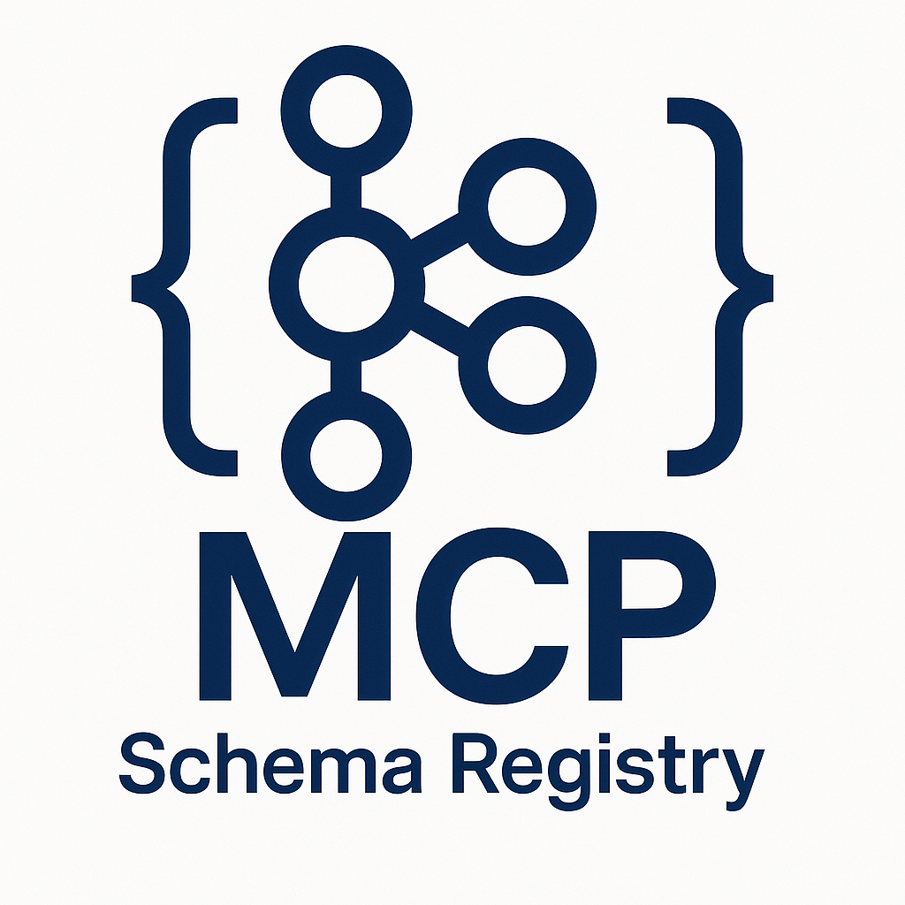

[](https://mseep.ai/app/aywengo-kafka-schema-reg-mcp)

# Kafka Schema Registry MCP Server

A comprehensive **Message Control Protocol (MCP) server** that provide
s Claude Desktop and other MCP clients with tools for Kafka Schema Registry operations. Features include advanced **Schema Context** support for logical schema grouping, **Configuration Management** for compatibility settings, **Mode Control** for operational state management, and **comprehensive Schema Export** capabilities for backup, migration, and schema documentation.

<table width="100%">
<tr>
<td width="33%" style="vertical-align: top;">
<div style="background-color: white; padding: 20px; border-radius: 10px;">
  
</div>
</td>
<td width="67%" style="vertical-align: top; padding-left: 20px;">

> **🎯 True MCP Implementation**: This server uses the modern **FastMCP 2.8.0+ framework** with full **MCP 2025-06-18 specification compliance**, communicating via JSON-RPC over stdio and supporting advanced transports like SSE and HTTP. It's fully compatible with Claude Desktop and other MCP clients.
</td>
</tr>
</table>

## ✨ Features

### **🤖 MCP Integration**
- **Claude Desktop Compatible**: Direct integration with Claude Desktop via MCP protocol
- **MCP Tools**: 20+ tools for schema operations, context management, configuration, and export
- **MCP Resources**: Real-time status and configuration information accessible to AI
- **JSON-RPC Protocol**: Standard MCP communication over stdio

### **📋 Schema Management**
- **Complete Schema Operations**: Register, retrieve, and manage Avro schemas via MCP tools
- **Schema Contexts**: Logical grouping with separate "sub-registries" 
- **Version Control**: Handle multiple schema versions with compatibility checking
- **Compatibility Testing**: Verify schema evolution before registration
- **Subject Management**: List and delete schema subjects through MCP

### **⚙️ Advanced Features**
- **Multi-Registry Support**: Connect to up to 8 Schema Registry instances simultaneously
- **Per-Registry READONLY Mode**: Individual readonly protection per registry for production safety
- **Cross-Registry Operations**: Compare, migrate, and synchronize schemas between registries
- **Configuration Management**: Control compatibility levels globally and per-subject
- **Mode Control**: Manage operational states (READWRITE, READONLY, IMPORT)
- **Schema Export**: Comprehensive export with JSON, Avro IDL formats
- **Context Isolation**: Schemas in different contexts are completely isolated
- **Authentication Support**: Optional basic authentication for Schema Registry

### 📋 MCP Features
- ✅ **48 MCP Tools**: Complete schema operations via natural language
- ✅ **Async Task Management**: Non-blocking operations with ThreadPoolExecutor
- ✅ **Real-Time Progress Tracking**: Monitor long-running operations (0-100%)
- ✅ **Task Lifecycle Control**: Create, monitor, cancel operations
- ✅ **Multi-Registry Support**: Manage up to 8 Schema Registry instances
- ✅ **Numbered Environment Config**: Clean `SCHEMA_REGISTRY_NAME_X`, `SCHEMA_REGISTRY_URL_X` pattern
- ✅ **Per-Registry READONLY**: Independent `READONLY_X` mode control
- ✅ **Cross-Registry Operations**: Compare, migrate, and sync schemas
- ✅ **Context Management**: Production/staging environment isolation  
- ✅ **Schema Evolution**: Compatibility testing and version control
- ✅ **Export System**: JSON, Avro IDL formats for backup/migration
- ✅ **Configuration Control**: Global and per-context compatibility settings
- ✅ **Claude Desktop Ready**: Direct integration with AI workflows
- ✅ **Multi-Platform Support**: AMD64 and ARM64 architectures
- ✅ **Stable Tag**: Use `:stable` for production deployments
- ✅ **Schema Statistics**: Comprehensive counting and analysis tools for contexts, schemas, and versions

## 🏗️ Architecture

- **Unified Server Design**: Single `kafka_schema_registry_unified_mcp.py` that auto-detects single vs multi-registry mode
- **FastMCP 2.8.0+ Framework**: Modern MCP architecture with MCP 2025-06-18 specification compliance
- **Enhanced Authentication**: Native FastMCP BearerAuth provider with OAuth 2.0 support for 5 identity platforms
- **Multi-Transport Support**: stdio, SSE, and Streamable HTTP transports via FastMCP
- **Kafka Schema Registry Integration**: Backend for schema storage and management  
- **KRaft Mode Support**: Works with modern Kafka without Zookeeper dependency
- **Context-Aware Operations**: All tools support optional context parameters
- **Claude Desktop Integration**: Direct integration with Claude Desktop via MCP configuration
- **Enterprise-Ready**: Granular control over compatibility and operational modes
- **Multi-Format Export**: JSON and Avro IDL export formats through MCP tools
- **Backward Compatibility**: 100% compatible with existing single-registry configurations

## 🚀 Quick Start

### Prerequisites
- **Docker** (recommended) OR **Python 3.11+**
- **Claude Desktop** (for AI integration)
- **Kafka Schema Registry** (running and accessible)

### Option 1: Docker (Recommended)

#### Pull from DockerHub
```bash
# Current stable release (v1.8.3)
docker pull aywengo/kafka-schema-reg-mcp:stable

# Or use latest (may be pre-release)
docker pull aywengo/kafka-schema-reg-mcp:latest

# FastMCP 2.8.0+ testing (v2.0.0)
docker pull aywengo/kafka-schema-reg-mcp:2.0.0

# Or specific stable version
docker pull aywengo/kafka-schema-reg-mcp:1.8.3
```

#### Test the Docker image
```bash
# Test MCP server in Docker
python tests/test_docker_mcp.py
```

#### Use with existing infrastructure
```bash
# Start with docker-compose (includes Schema Registry)
docker-compose up -d
```

### Option 2: Local Installation

#### Step 1: Install Dependencies
```bash
# Clone the repository
git clone https://github.com/aywengo/kafka-schema-reg-mcp
cd kafka-schema-reg-mcp

# Install Python dependencies
pip install -r requirements.txt
```

#### Step 2: Configure Environment

**Single Registry Mode (Backward Compatible):**
```bash
# Basic Schema Registry connection
export SCHEMA_REGISTRY_URL="http://localhost:8081"
export SCHEMA_REGISTRY_USER=""           # Optional
export SCHEMA_REGISTRY_PASSWORD=""       # Optional
export READONLY="false"                  # Global readonly mode
```

**Multi-Registry Mode (New - Up to 8 Registries):**
```bash
# Registry 1 - Development
export SCHEMA_REGISTRY_NAME_1="development"
export SCHEMA_REGISTRY_URL_1="http://dev-schema-registry:8081"
export SCHEMA_REGISTRY_USER_1="dev-user"      # Optional
export SCHEMA_REGISTRY_PASSWORD_1="dev-pass"  # Optional
export READONLY_1="false"                     # Per-registry readonly

# Registry 2 - Production (with safety)
export SCHEMA_REGISTRY_NAME_2="production"
export SCHEMA_REGISTRY_URL_2="http://prod-schema-registry:8081"
export SCHEMA_REGISTRY_USER_2="prod-user"
export SCHEMA_REGISTRY_PASSWORD_2="prod-pass"
export READONLY_2="true"                      # Production safety
```

#### Environment Variables

| Variable | Description | Default | Example |
|----------|-------------|---------|---------|
| **Single Registry Mode** | | | |
| `SCHEMA_REGISTRY_URL` | Schema Registry endpoint | `http://localhost:8081` | `http://schema-registry:8081` |
| `SCHEMA_REGISTRY_USER` | Username for authentication | *(empty)* | `admin` |
| `SCHEMA_REGISTRY_PASSWORD` | Password for authentication | *(empty)* | `password123` |
| `READONLY` | Global read-only mode | `false` | `true` |
| **Multi-Registry Mode** | | | |
| `SCHEMA_REGISTRY_NAME_X` | Registry alias (X=1-8) | *(required)* | `production` |
| `SCHEMA_REGISTRY_URL_X` | Registry endpoint (X=1-8) | *(required)* | `http://prod-registry:8081` |
| `SCHEMA_REGISTRY_USER_X` | Username (X=1-8) | *(empty)* | `prod-user` |
| `SCHEMA_REGISTRY_PASSWORD_X` | Password (X=1-8) | *(empty)* | `prod-password` |
| `READONLY_X` | Per-registry readonly (X=1-8) | `false` | `true` |
| **Security Settings** | | | |
| `ALLOW_LOCALHOST` | Allow localhost URLs (dev/test only) | `false` | `true` |
| `TESTING` | Enable test mode | `false` | `true` |

#### 🔒 READONLY Mode (Production Safety Feature)

When `READONLY=true` is set, the MCP server blocks all modification operations while keeping read and export operations available. Perfect for production environments where you want to prevent accidental changes.

**Blocked Operations:**
- ❌ Schema registration and deletion
- ❌ Context creation and deletion  
- ❌ Configuration changes
- ❌ Mode modifications

**Allowed Operations:**
- ✅ Schema browsing and retrieval
- ✅ Compatibility checking (read-only)
- ✅ All export operations
- ✅ Configuration reading

**Usage Examples:**
```bash
# Production environment with read-only protection
export READONLY=true
python kafka_schema_registry_mcp.py

# Docker with read-only mode
docker run -e READONLY=true -e SCHEMA_REGISTRY_URL=http://localhost:8081 aywengo/kafka-schema-reg-mcp:stable

# Claude Desktop configuration with read-only mode
{
  "env": {
    "SCHEMA_REGISTRY_URL": "http://localhost:8081",
    "READONLY": "true"
  }
}
```

#### Step 3: Run the Unified Server
```bash
# The unified server automatically detects single vs multi-registry mode
python kafka_schema_registry_unified_mcp.py
```

#### Step 4: Test with Complete Test Suite
```bash
# Run the unified test runner (starts environment + runs all tests)
cd tests
./run_all_tests.sh

# Or run essential tests only (faster)
./run_all_tests.sh --quick

# Or use the simple wrapper
./test-unified.sh
```

### Configure Claude Desktop

#### Ready-to-Use Configuration Examples

All configuration examples are available in the [`config-examples/`](config-examples/) directory with updated port configurations.

**Quick Setup:**
```bash
# Copy the configuration that matches your use case
cp config-examples/claude_desktop_stable_config.json ~/Library/Application\ Support/Claude/claude_desktop_config.json

# Or for Linux
cp config-examples/claude_desktop_stable_config.json ~/.config/claude-desktop/config.json
```

#### Option A: Using Docker (Recommended)

**Stable Tag (Recommended for Production):**
```bash
# Use the pre-configured stable setup
cp config-examples/claude_desktop_stable_config.json ~/Library/Application\ Support/Claude/claude_desktop_config.json
```

**Latest Tag:**
```bash
# Use the latest Docker image
cp config-examples/claude_desktop_docker_config.json ~/Library/Application\ Support/Claude/claude_desktop_config.json
```

**Multi-Registry Setup:**
```bash
# For multi-environment schema management
cp config-examples/claude_desktop_multi_registry_docker.json ~/Library/Application\ Support/Claude/claude_desktop_config.json
```

#### Option B: Local Python Installation
```bash
# For local development
cp config-examples/claude_desktop_config.json ~/Library/Application\ Support/Claude/claude_desktop_config.json
```

#### Configuration Options Available

| Configuration | Use Case | Description |
|---------------|----------|-------------|
| `claude_desktop_stable_config.json` | **Production** | Docker stable tag, single registry |
| `claude_desktop_multi_registry_docker.json` | **Multi-Environment** | Docker with DEV/STAGING/PROD registries |
| `claude_desktop_config.json` | **Local Development** | Python local execution |
| `claude_desktop_readonly_config.json` | **Production Safety** | Read-only mode enforced |
| `claude_desktop_simple_multi.json` | **Simple Multi-Registry** | 2-registry setup (dev + prod) |

**📖 Complete Configuration Guide**: [`config-examples/README.md`](config-examples/README.md)

Copy the configuration to your Claude Desktop config file:
- **macOS**: `~/Library/Application Support/Claude/claude_desktop_config.json`  
- **Windows**: `%APPDATA%\Claude\claude_desktop_config.json`

> **💡 Configuration Pattern**: The `-e VARIABLE_NAME` pattern (without values) in args combined with the `env` section is the recommended approach. This separates Docker arguments from configuration values, making the setup more maintainable and secure.

### Step 5: Use with Claude Desktop
1. Restart Claude Desktop
2. Look for the 🔨 tools icon in the interface
3. Start asking Claude to help with schema operations!

**Single Registry Example prompts:**
- "List all schema contexts"
- "Show me the subjects in the production context"
- "Register a new user schema with fields for id, name, and email"
- "Export all schemas from the staging context"

**Multi-Registry Example prompts:**
- "List all my Schema Registry instances"
- "Compare development and production registries"
- "Migrate user-events schema from staging to production"
- "Test connections to all registries"
- "Register a schema in the development registry"

## 📋 MCP Tools & Resources

The MCP server provides **20 comprehensive tools** and **2 resources** for all Schema Registry operations:

### **🔧 Available Tools**
- **Schema Management**: `register_schema`, `get_schema`, `get_schema_versions`, `check_compatibility`
- **Context Management**: `list_contexts`, `create_context`, `delete_context`
- **Subject Management**: `list_subjects`, `delete_subject`
- **Configuration Management**: `get_global_config`, `update_global_config`, `get_subject_config`, `update_subject_config`
- **Mode Control**: `get_mode`, `update_mode`, `get_subject_mode`, `update_subject_mode`
- **Schema Export**: `export_schema`, `export_subject`, `export_context`, `export_global`
- **Registry Metadata**: `get_registry_metadata`, `get_registry_version_info`, `get_registry_cluster_info` *(NEW)*

### **📦 Available Resources**
- **`registry://status`**: Real-time Schema Registry connection status
- **`registry://info`**: Detailed server configuration and capabilities

### **Claude Desktop Usage Examples**
With the MCP server connected to Claude Desktop, you can use natural language:

```
"List all schema contexts"
"Show me the subjects in the production context"
"Register a new user schema with fields for id, name, and email"
"Export all schemas from the staging context in Avro IDL format"
"Check if my updated schema is compatible with the latest version"
"Get the current configuration for the user-events subject"
```

### **🔍 Registry Metadata Integration**
The MCP server now automatically includes comprehensive Schema Registry metadata in existing methods using the `/v1/metadata/*` endpoints:

- **`get_registry_info`**: Primary method for complete registry information with metadata
- **Enhanced existing methods**: All test, statistics, and info methods now include metadata automatically
- **Seamless integration**: No breaking changes - metadata is added to existing responses

**Example Usage:**
```
"Get registry information" # Now includes comprehensive metadata
"Test the registry connection and show metadata"
"Count all schemas and include registry version information"
```

**Example Metadata Response:**
```json
{
  "version": "7.6.0",
  "commit_id": "02d9aa023a8d034d480a718242df2a880e0be1f7",
  "kafka_cluster_id": "MkVlNjdqWVF0Q056MWFrUA",
  "schema_registry_cluster_id": "schema-registry"
}
```

### **🧪 Enhanced Existing Methods with Metadata**
All existing test and statistics methods now automatically include registry metadata:

- **`test_registry_connection`**: Now includes version, commit ID, and cluster information
- **`test_all_registries`**: Enhanced with metadata for each registry tested
- **`count_schemas`, `count_contexts`, `count_schema_versions`**: All statistics include registry context
- **`get_registry_statistics`**: Comprehensive stats with full metadata
- **`get_registry_info`**: Enhanced with server metadata automatically

**Example Usage:**
```
"Test the registry connection" # Now includes metadata automatically
"Count all schemas" # Now includes registry version and cluster info
"Get registry statistics" # Now includes comprehensive metadata
```

**Enhanced Statistics Response:**
```json
{
  "registry": "default",
  "total_contexts": 3,
  "total_schemas": 15,
  "total_versions": 42,
  "counted_at": "2024-01-15T10:30:00Z",
  "version": "7.6.0",
  "commit_id": "02d9aa023a8d034d480a718242df2a880e0be1f7",
  "kafka_cluster_id": "MkVlNjdqWVF0Q056MWFrUA",
  "schema_registry_cluster_id": "schema-registry"
}
```

**📖 Complete Tool Documentation**: [API Reference](docs/api-reference.md)

## 💬 MCP Prompts & Guided Workflows

The MCP server includes **8 comprehensive prompts** that provide guided workflows and best practices for schema management. These prompts appear in Claude Desktop to help you learn and execute complex operations.

### **🚀 Available Prompts**

| Prompt | Purpose | Best For |
|---------|---------|----------|
| **`schema-getting-started`** | Introduction to basic operations | New users, onboarding |
| **`schema-registration`** | Complete guide for registering schemas | Developers, schema creation |
| **`context-management`** | Organizing schemas by environment/team | DevOps, multi-environment setups |
| **`schema-export`** | Export for backup, docs, compliance | Documentation, backup procedures |
| **`multi-registry`** | Managing multiple registries | Multi-environment, disaster recovery |
| **`schema-compatibility`** | Safe schema evolution | Schema changes, production safety |
| **`troubleshooting`** | Diagnose and resolve issues | Problem resolution, debugging |
| **`advanced-workflows`** | Enterprise patterns and automation | Complex deployments, team coordination |

### **🎮 How to Use Prompts**

#### In Claude Desktop:
```
Human: Show me the schema-getting-started prompt

Claude: [Displays comprehensive getting started guide with examples]
```

```
Human: I need help with schema compatibility

Claude: Let me show you the schema-compatibility prompt which covers compatibility levels, safe vs breaking changes, and evolution workflows.
```

#### **Learning Path Recommendations:**

**🔰 Beginner Path** (15-30 minutes):
1. `schema-getting-started` - Understand basics
2. `schema-registration` - Register your first schema  
3. `context-management` - Organize with contexts

**⚡ Intermediate Path** (30-60 minutes):
4. `schema-export` - Document and backup
5. `schema-compatibility` - Safe evolution
6. `troubleshooting` - Handle common issues

**🚀 Advanced Path** (1-2 hours):
7. `multi-registry` - Multi-environment management
8. `advanced-workflows` - Enterprise patterns

### **📋 Prompt Features**

- **🎯 Actionable Commands**: Direct copy-paste examples for immediate use
- **📖 Step-by-Step Workflows**: Guided processes for complex operations
- **🏢 Enterprise Patterns**: Real-world scenarios and best practices
- **🔗 Cross-References**: Connections between related prompts and tools
- **📊 Use Case Examples**: Concrete scenarios for different industries

### **🛠️ Role-Based Recommendations**

| Role | Recommended Prompts |
|------|-------------------|
| **Developers** | `schema-registration`, `schema-compatibility` |
| **DevOps Engineers** | `multi-registry`, `advanced-workflows` |
| **Data Engineers** | `schema-export`, `context-management` |
| **System Administrators** | `troubleshooting`, `multi-registry` |

**📖 Complete Prompts Guide**: [MCP Prompts Documentation](docs/prompts-guide.md)

## 🎯 Key Capabilities

### **📦 Schema Export System**
Comprehensive export functionality with 17 endpoints supporting backup, migration, and documentation:
- **Multiple Formats**: JSON, Avro IDL, ZIP bundles
- **Flexible Scopes**: Single schemas, subjects, contexts, or global exports
- **Use Cases**: Environment promotion, disaster recovery, compliance auditing, documentation generation

**📖 Detailed Guide**: [API Reference - Export Endpoints](docs/api-reference.md#export-endpoints)

### **🔄 Schema Migration Capabilities**
Advanced migration tools for moving schemas between registries and contexts:

#### Context Migration (Docker-Based)
The `migrate_context` tool generates ready-to-run Docker commands using the [kafka-schema-reg-migrator](https://github.com/aywengo/kafka-schema-reg-migrator):
- **Single Command**: Returns complete Docker command with all environment variables
- **Automatic Mapping**: Registry credentials and contexts automatically configured
- **Immediate Execution**: Copy command and run - no file setup required
- **External Tool Integration**: Leverages specialized migration tool for robust operations

**Example:**
```
Human: "Migrate all schemas from development context to production"

Claude: I'll generate the Docker migration command for you.

[Uses migrate_context MCP tool]
🚀 Ready to migrate development context to production:

Copy and run this command:
docker run --platform linux/amd64 --network host -it --rm \
  -e SOURCE_SCHEMA_REGISTRY_URL=http://dev-registry:8081 \
  -e DEST_SCHEMA_REGISTRY_URL=http://prod-registry:8082 \
  -e ENABLE_MIGRATION=true \
  -e DRY_RUN=true \
  -e PRESERVE_IDS=true \
  -e SOURCE_CONTEXT=development \
  -e DEST_CONTEXT=production \
  aywengo/kafka-schema-reg-migrator:latest

Set DRY_RUN=false when ready for actual migration.
```

#### Direct Schema Migration
Individual schemas can be migrated directly using `migrate_schema`:
- **Version Control**: Migrate specific versions or all versions
- **ID Preservation**: Maintain schema IDs using IMPORT mode
- **Compatibility Checking**: Ensure schema compatibility

**📖 Migration Guide**: [MCP Tools Reference - Migration](docs/mcp-tools-reference.md#29-migrate_context)

### **🏗️ Schema Contexts** 
Powerful logical grouping for enterprise schema management:
- **Environment Isolation**: Separate development, staging, production
- **Multi-Tenancy**: Client-specific schema isolation
- **Team Boundaries**: Organize schemas by development teams
- **Operational Benefits**: Namespace collision prevention, context-aware governance

**📖 Real-World Examples**: [Use Cases - Enterprise Scenarios](docs/use-cases.md#-enterprise-use-cases)

### **⚙️ Configuration & Mode Control**
Enterprise-grade operational control:
- **Compatibility Management**: Global and subject-level compatibility controls
- **Operational Modes**: READWRITE, READONLY, IMPORT for controlled access
- **Context-Aware Settings**: Different rules per environment
- **Governance**: Policy enforcement and change control

**📖 Complete Reference**: [API Reference - Configuration](docs/api-reference.md#configuration-management)

## 🔑 Authentication Overview

There are two types of authentication in this project:

1. **Schema Registry Authentication** (Backend):
   - Controls how the MCP server connects to your Kafka Schema Registry instances.
   - Set via `SCHEMA_REGISTRY_USER`, `SCHEMA_REGISTRY_PASSWORD` (and their multi-registry variants).
   - These credentials are NOT used to authenticate users of the MCP server itself.

2. **MCP Server Authentication** (Frontend):
   - Controls who can access the MCP server and its tools.
   - Enable with `ENABLE_AUTH=true` and configure via `AUTH_ISSUER_URL`, `AUTH_VALID_SCOPES`, etc.
   - This is optional and defaults to open access if not set.

> **Note:** Setting `SCHEMA_REGISTRY_USER`/`PASSWORD` only protects the connection to the backend registry, not the MCP server API/tools. To secure the MCP server itself, use the `ENABLE_AUTH` and related variables.

## 🔐 Authentication

> **There are two layers of authentication:**
>
> - **Schema Registry Auth**: Controls how the MCP server connects to the backend registry. Set `SCHEMA_REGISTRY_USER`/`PASSWORD` (and `_X` variants for multi-registry) for this purpose.
> - **MCP Server Auth**: Controls who can access the MCP server and its tools. Use `ENABLE_AUTH` and related `AUTH_*` variables to secure the MCP server itself.

**To secure the MCP server itself, you must set `ENABLE_AUTH=true` and configure the OAuth2 variables.**

### Environment Variables (Authentication & Authorization)

| Variable | Description | Default | Applies To |
|----------|-------------|---------|------------|
| `SCHEMA_REGISTRY_USER` | Username for backend Schema Registry | *(empty)* | Schema Registry (backend) |
| `SCHEMA_REGISTRY_PASSWORD` | Password for backend Schema Registry | *(empty)* | Schema Registry (backend) |
| `SCHEMA_REGISTRY_USER_X` | Username for multi-registry backend | *(empty)* | Schema Registry (backend) |
| `SCHEMA_REGISTRY_PASSWORD_X` | Password for multi-registry backend | *(empty)* | Schema Registry (backend) |
| `ENABLE_AUTH` | Enable OAuth 2.1 authentication/authorization | `false` | MCP Server (frontend) |
| `AUTH_ISSUER_URL` | OAuth 2.1 issuer URL (uses automatic discovery) | `https://example.com` | MCP Server (frontend) |
| `AUTH_AUDIENCE` | OAuth client ID or API identifier | *(empty)* | MCP Server (frontend) |
| `AUTH_VALID_SCOPES` | Comma-separated list of valid scopes | `read,write,admin` | MCP Server (frontend) |
| `AUTH_DEFAULT_SCOPES` | Comma-separated list of default scopes | `read` | MCP Server (frontend) |
| `AUTH_REQUIRED_SCOPES` | Comma-separated list of required scopes | `read` | MCP Server (frontend) |

## 🔐 OAuth Scopes & Authorization

The MCP server implements a three-tier permission system when OAuth authentication is enabled (`ENABLE_AUTH=true`):

### **🎯 Permission Scopes**

| Scope | Permissions | Description |
|-------|-------------|-------------|
| **`read`** | View schemas, subjects, configurations | Basic read-only access to all schema information |
| **`write`** | Register schemas, update configs (includes `read`) | Schema modification and configuration management |
| **`admin`** | Delete subjects, manage registries (includes `write` + `read`) | Full administrative access |

### **🛠️ Tool-Level Authorization**

All MCP tools are protected by scopes:

#### Read Scope (`read`) — View/Export/Status Operations
- `list_registries`, `get_registry_info`, `test_registry_connection`, `test_all_registries`
- `compare_registries`, `compare_contexts_across_registries`, `find_missing_schemas`
- `get_schema`, `get_schema_versions`, `list_subjects`, `check_compatibility`
- `get_global_config`, `get_subject_config`
- `get_mode`, `get_subject_mode`
- `list_contexts`
- `export_schema`, `export_subject`, `export_context`, `export_global`
- `list_migrations`, `get_migration_status`
- `count_contexts`, `count_schemas`, `count_schema_versions`, `get_registry_statistics`
- `get_task_status`, `get_task_progress`, `list_active_tasks`, `list_statistics_tasks`, `get_statistics_task_progress`
- `get_default_registry`, `check_readonly_mode`, `get_oauth_scopes_info`, `get_operation_info_tool`
- `get_registry_metadata`, `get_registry_version_info`, `get_registry_cluster_info`
- `test_registry_connection_with_metadata`, `test_schema_operations_with_metadata`, `validate_registry_health_with_metadata`
- `benchmark_registry_performance_with_metadata`, `generate_registry_report_with_metadata` *(NEW)*

#### Write Scope (`write`) — Modification Operations
- `register_schema`
- `update_global_config`, `update_subject_config`
- `update_mode`, `update_subject_mode`
- `create_context`

#### Admin Scope (`admin`) — Administrative/Cleanup Operations
- `delete_context`, `delete_subject`
- `migrate_schema`, `migrate_context`
- `clear_context_batch`, `clear_multiple_contexts_batch`
- `set_default_registry`, `cancel_task`

> **Note:** The `get_oauth_scopes_info` tool will show the enforced required scopes for every tool, as defined in the code. Use it to audit or discover permissions for any operation.

### **🧪 Development Testing**

For development and testing, you can use special development tokens:

```bash
# Format: dev-token-{scopes}
export OAUTH_TOKEN="dev-token-read,write,admin"  # Full access
export OAUTH_TOKEN="dev-token-read"              # Read-only access  
export OAUTH_TOKEN="dev-token-write"             # Read + Write access
```

### **🚀 OAuth 2.1 Generic Configuration (Simplified!)**

With OAuth 2.1 discovery, configuration is now **dramatically simplified**. Works with **any OAuth 2.1 compliant provider**:

#### Basic Configuration (Any OAuth 2.1 Provider)
```bash
export ENABLE_AUTH=true
export AUTH_ISSUER_URL="https://your-oauth-provider.com"
export AUTH_AUDIENCE="your-client-id-or-api-identifier"
```

#### Optional OAuth 2.1 Features
```bash
export REQUIRE_PKCE=true                     # PKCE enforcement (default: true)
export RESOURCE_INDICATORS="https://api.com" # Resource validation
export TOKEN_BINDING_ENABLED=true            # Token binding support
```

#### Provider Examples (Using Generic Configuration)

**Azure AD:**
```bash
export AUTH_ISSUER_URL="https://login.microsoftonline.com/your-tenant-id/v2.0"
export AUTH_AUDIENCE="your-azure-client-id"
```

**Google OAuth 2.0:**
```bash
export AUTH_ISSUER_URL="https://accounts.google.com"
export AUTH_AUDIENCE="your-client-id.apps.googleusercontent.com"
```

**Okta:**
```bash
export AUTH_ISSUER_URL="https://your-domain.okta.com/oauth2/default"
export AUTH_AUDIENCE="api://your-api-identifier"
```

**Keycloak:**
```bash
export AUTH_ISSUER_URL="https://keycloak.example.com/realms/your-realm"
export AUTH_AUDIENCE="your-keycloak-client-id"
```

**GitHub (Limited OAuth 2.1 Support):**
```bash
export AUTH_ISSUER_URL="https://github.com"
export AUTH_AUDIENCE="your-github-client-id"
```

#### Environment-Specific Scope Configuration

**Development Environment (Permissive):**
```bash
export AUTH_VALID_SCOPES="read,write,admin"
export AUTH_DEFAULT_SCOPES="read"
export AUTH_REQUIRED_SCOPES="read"
```

**Production Environment (Restrictive):**
```bash
export AUTH_VALID_SCOPES="read,write"
export AUTH_DEFAULT_SCOPES="read"
export AUTH_REQUIRED_SCOPES="read,write"
```

**Read-Only Environment (Analytics/Monitoring):**
```bash
export AUTH_VALID_SCOPES="read"
export AUTH_DEFAULT_SCOPES="read"
export AUTH_REQUIRED_SCOPES="read"
```

### **📋 Scope Information Tool**

Use the `get_oauth_scopes_info` MCP tool to discover:
- Available scopes and their permissions
- Required scopes for each tool
- Development token formats
- Current authentication configuration

**Example usage with Claude:**
```
"Show me the OAuth scopes and which tools require which permissions"
"What development tokens can I use for testing?"
"Which tools require admin access?"
```

### **🔍 OAuth 2.1 Discovery Endpoints**

The MCP server implements **OAuth 2.1 compliant discovery** for seamless integration with any OAuth 2.1 provider:

#### **Available Discovery Endpoints**

| Endpoint | Purpose | RFC Standard |
|----------|---------|--------------|
| `/.well-known/oauth-authorization-server` | Authorization server metadata | RFC 8414 |
| `/.well-known/oauth-protected-resource` | Protected resource metadata | RFC 8692 |
| `/.well-known/jwks.json` | JSON Web Key Set for token validation | RFC 7517 |

#### **🚀 OAuth 2.1 Discovery Features**

- **🔍 Automatic Discovery**: Uses standard OAuth 2.1 discovery (RFC 8414) - **no provider-specific configuration needed**
- **🌐 Universal Compatibility**: Works with **any** OAuth 2.1 compliant provider
- **🛡️ Enhanced Security**: PKCE enforcement, Resource Indicators (RFC 8707), Audience validation
- **🚀 MCP Extensions**: Additional metadata for MCP-specific features and capabilities
- **🔒 Security**: JWKS proxying with intelligent caching and TTL management  
- **📊 Server Info**: Exposes MCP server capabilities, tools, and endpoint information
- **⚡ Fallback Support**: Graceful handling for providers with limited OAuth 2.1 support (e.g., GitHub)

#### **Testing Discovery Endpoints**

Use the built-in MCP tool to validate discovery endpoints:

```bash
# Test all discovery endpoints
curl -X POST http://localhost:8000/mcp \
  -H "Content-Type: application/json" \
  -d '{"jsonrpc": "2.0", "id": 1, "method": "tools/call", "params": {"name": "test_oauth_discovery_endpoints", "arguments": {"server_url": "http://localhost:8000"}}}'
```

**Claude Desktop Usage:**
```
"Test the OAuth discovery endpoints"
"Check if my server is properly configured for MCP client discovery"
```

#### **🔄 Generic Discovery Approach**

**Key Benefits:**
- **🚀 Simplified Setup**: Just set `AUTH_ISSUER_URL` and `AUTH_AUDIENCE` - endpoints discovered automatically
- **🔄 Future-Proof**: Works with new OAuth 2.1 providers without code changes
- **🛡️ Standards Compliant**: Uses RFC 8414 discovery, not provider-specific hardcoded endpoints
- **⚡ Automatic Updates**: Providers can update endpoints and the server adapts automatically

#### **Discovery Endpoint Response Examples**

**Authorization Server Metadata** (`/.well-known/oauth-authorization-server`):
```json
{
  "issuer": "https://your-oauth-provider.com",
  "authorization_endpoint": "https://your-oauth-provider.com/oauth2/authorize",
  "token_endpoint": "https://your-oauth-provider.com/oauth2/token",
  "jwks_uri": "https://your-oauth-provider.com/oauth2/jwks",
  "token_introspection_endpoint": "https://your-oauth-provider.com/oauth2/introspect",
  "revocation_endpoint": "https://your-oauth-provider.com/oauth2/revoke",
  "scopes_supported": ["read", "write", "admin", "openid", "email", "profile"],
  "response_types_supported": ["code"],
  "grant_types_supported": ["authorization_code", "client_credentials"],
  "code_challenge_methods_supported": ["S256"],
  "require_pkce": true,
  "mcp_server_version": "2.0.0",
  "mcp_transport": "streamable-http",
  "oauth_2_1_compliant": true
}
```

**Protected Resource Metadata** (`/.well-known/oauth-protected-resource`):
```json
{
  "resource": "https://your-mcp-server.com",
  "authorization_servers": ["https://your-oauth-provider.com"],
  "scopes_supported": ["read", "write", "admin"],
  "scope_descriptions": {
    "read": "Can view schemas, subjects, configurations",
    "write": "Can register schemas, update configs (includes read permissions)",
    "admin": "Can delete subjects, manage registries (includes write and read permissions)"
  },
  "require_pkce": true,
  "pkce_code_challenge_methods": ["S256"],
  "pkce_note": "PKCE (Proof Key for Code Exchange) is mandatory per OAuth 2.1",
  "oauth_2_1_features": {
    "resource_indicators": true,
    "pkce_required": true,
    "audience_validation": true,
    "discovery_method": "RFC 8414"
  },
  "mcp_server_info": {
    "name": "Kafka Schema Registry MCP Server",
    "version": "2.0.0",
    "transport": "streamable-http",
    "tools_count": 48,
    "discovery_method": "Generic OAuth 2.1 (RFC 8414)"
  }
}
```

#### **🛡️ PKCE Requirements (MANDATORY)**

**PKCE (Proof Key for Code Exchange) is mandatory according to the MCP authorization specification.**

All MCP clients MUST implement PKCE with SHA256 (`S256`) code challenge method:

1. **Generate Code Verifier**: Random 43-128 character string
2. **Calculate Code Challenge**: `BASE64URL(SHA256(code_verifier))`
3. **Include in Authorization**: Send `code_challenge` and `code_challenge_method=S256`
4. **Exchange Code**: Send `code_verifier` when exchanging authorization code

**Server-Side Validation Example:**
```python
def validate_pkce(code_verifier, stored_challenge):
    calculated = base64.urlsafe_b64encode(
        hashlib.sha256(code_verifier.encode()).digest()
    ).rstrip(b'=').decode()
    return calculated == stored_challenge
```

**Discovery Response Indicates PKCE is Required:**
```json
{
  "code_challenge_methods_supported": ["S256"],
  "require_pkce": true,
  "pkce_note": "PKCE (Proof Key for Code Exchange) is mandatory for all authorization flows"
}
```

> **⚠️ Critical**: MCP clients will fail silently if PKCE is not properly implemented. The discovery endpoints ensure clients can detect PKCE requirements automatically.

#### **Benefits for MCP Clients**

- **🤖 Automatic Configuration**: Clients discover OAuth settings without manual configuration
- **⚡ Reduced Setup**: No need to hardcode authorization server URLs or provider-specific configurations
- **🔄 Dynamic Updates**: Clients can adapt to server configuration changes automatically
- **🛡️ Security Validation**: Proper JWT validation with JWKS discovery and caching
- **📊 Capability Discovery**: Clients learn about server features, tools, and OAuth 2.1 compliance
- **🚀 Provider Agnostic**: Works with any OAuth 2.1 compliant provider - no special handling needed

> **🎯 Migration from Provider-Specific**: Old configurations using `AUTH_PROVIDER=azure/google/okta` are automatically migrated to the generic OAuth 2.1 approach. Simply update to use `AUTH_ISSUER_URL` and `AUTH_AUDIENCE` for a cleaner, more maintainable setup.

> **💡 Note**: Discovery endpoints return 404 when OAuth is disabled (`ENABLE_AUTH=false`), which is the expected behavior for MCP clients.

### **🛡️ Security Best Practices**

1. **Principle of Least Privilege**: Grant only the minimum scopes needed
2. **Environment Separation**: Use different scope configurations per environment  
3. **Read-Only Production**: Consider read-only scopes for production monitoring
4. **Development Tokens**: Only use `dev-token-*` formats in development environments
5. **Token Rotation**: Implement regular token rotation in production
6. **Discovery Endpoint Security**: OAuth discovery endpoints use proper CORS and caching headers

### **🔒 URL Security & SSRF Protection**

The MCP server implements strict URL validation to prevent Server-Side Request Forgery (SSRF) attacks:

#### **URL Restrictions**
- **Allowed Protocols**: Only `http` and `https` protocols are permitted
- **Blocked Addresses**: 
  - Localhost addresses (`localhost`, `127.0.0.1`, `0.0.0.0`) are blocked in production
  - Private IP ranges (e.g., `10.x.x.x`, `172.16.x.x`, `192.168.x.x`) are blocked in production
- **Context Injection Protection**: Context parameters in URLs are properly encoded to prevent injection attacks

#### **Development & Testing**
For development and testing environments, localhost URLs can be allowed by setting one of:
- `TESTING=true` - Enable test mode
- `ALLOW_LOCALHOST=true` - Explicitly allow localhost URLs
- `CI=true` - For CI/CD pipelines
- Running tests with pytest (automatically detected)
- Working directory containing "test" (automatically detected)

**Example:**
```bash
# Development with localhost Schema Registry
export ALLOW_LOCALHOST=true
export SCHEMA_REGISTRY_URL="http://localhost:8081"

# Production (localhost blocked by default)
export SCHEMA_REGISTRY_URL="https://schema-registry.example.com:8081"
```

#### **Error Handling**
If an invalid or unsafe URL is configured:
- The registry will fail to load with error: `"Invalid or unsafe registry URL"`
- The error is logged but the server continues with other valid registries
- Multi-registry setups will skip invalid registries and continue with valid ones

### **🚨 Security Vulnerability Management**

The project includes automated security scanning via GitHub Actions, with documented handling of security exceptions:

#### Security Scanning
- **Trivy**: Container vulnerability scanning for critical, high, and medium severity issues
- **Safety & pip-audit**: Python dependency vulnerability scanning
- **TruffleHog**: Secrets detection in code and git history
- **Docker Bench Security**: Docker configuration security assessment

#### Security Exception Handling
Some vulnerabilities may be marked as "will_not_fix" by upstream maintainers when they:
- Are not exploitable in normal usage scenarios
- Would break compatibility if fixed
- Have no available fixes from the package maintainers

**Documented Exceptions:**
- All security exceptions are documented in `.trivyignore` with detailed rationale
- Each exception includes CVE reference, status explanation, and risk assessment
- Regular review process ensures exceptions remain valid

**Current Exceptions:**
- `CVE-2023-45853` (zlib): Integer overflow in zipOpenNewFileInZip4_6 function
  - Status: will_not_fix by Debian maintainers
  - Impact: Function not used in application context
  - Risk: Low - not exploitable in our use case

#### Security Configuration
```bash
# Disable VEX notices (already documented)
export TRIVY_DISABLE_VEX_NOTICE=true
```

The security scan workflow continues to monitor for new vulnerabilities while allowing documented exceptions to avoid false positives in CI/CD pipelines.

## 🧪 Testing

The project includes a unified, comprehensive test suite with automatic environment management.

#### Unified Test Runner (Recommended)

```bash
# Run complete test suite with automatic environment management
cd tests/
./run_all_tests.sh

# Or run essential tests only (faster)
./run_all_tests.sh --quick

# Keep environment running for debugging
./run_all_tests.sh --no-cleanup

# Show all available options
./run_all_tests.sh --help
```

#### Manual Environment Management

```bash
# Start unified environment (supports both single and multi-registry tests)
cd tests/
./start_test_environment.sh multi

# Run individual tests
python3 test_basic_server.py
python3 test_multi_registry_mcp.py

# Stop environment
./stop_test_environment.sh clean
```

#### Environment Mode Options

```bash
# Start only DEV registry (single-registry tests)
./start_test_environment.sh dev

# Start full environment (multi-registry tests)  
./start_test_environment.sh multi

# Start with UI monitoring
./start_test_environment.sh ui
```

## 🚀 Production Deployment

Production-ready with pre-built DockerHub images and comprehensive deployment options:

```bash
# Quick production start with pre-built images
docker-compose up -d

# Or direct Docker usage with stable tag
docker run -d -p 38000:8000 aywengo/kafka-schema-reg-mcp:stable

# Or with latest tag
docker run -d -p 38000:8000 aywengo/kafka-schema-reg-mcp:latest
```

**📖 Complete Guide**: [Deployment Guide](docs/deployment.md) - Docker Compose, Kubernetes, cloud platforms, monitoring, CI/CD

## 🔧 Development

Quick local development setup:

```bash
# Local Python development
python -m venv .venv && source .venv/bin/activate
pip install -r requirements.txt && python mcp_server.py

# Docker development
mv docker-compose.override.yml docker-compose.override.yml.bak
docker-compose build --no-cache mcp-server && docker-compose up -d
```

**📖 Development Guide**: [Deployment Guide - Development](docs/deployment.md#-local-development)

## 📚 Documentation

Comprehensive documentation covering all aspects:

| Guide | Purpose |
|-------|---------|
| **[API Reference](docs/api-reference.md)** | Complete endpoint documentation with examples |
| **[Use Cases](docs/use-cases.md)** | Real-world scenarios and implementation patterns |
| **[IDE Integration](docs/ide-integration.md)** | VS Code, Claude Code, and Cursor setup guides |
| **[Deployment Guide](docs/deployment.md)** | Docker, Kubernetes, cloud platforms, CI/CD |

### 🛠️ IDE Integration
- **🔵 VS Code**: Extensions, workspace configuration, REST client testing
- **🤖 Claude Code**: AI-assisted schema development and context management  
- **⚡ Cursor**: AI-powered development with schema generation and visualization

**📖 Setup Instructions**: [IDE Integration Guide](docs/ide-integration.md)

## 🔗 Schema Registry Integration

Integrates with [Confluent Schema Registry](https://docs.confluent.io/platform/current/schema-registry/fundamentals/index.html) supporting multiple formats (Avro, JSON, Protobuf), schema evolution, and context-based namespace management.

**📖 Integration Details**: [Use Cases - Schema Registry Integration](docs/use-cases.md#-schema-registry-integration)

## 🆕 What's New in v2.0.x

- **🚀 OAuth 2.1 Generic Discovery**: Major architecture overhaul from provider-specific to universal OAuth 2.1 compatibility
  - **75% Less Configuration**: Just 2 variables (`AUTH_ISSUER_URL` + `AUTH_AUDIENCE`) instead of 8+ provider-specific ones
  - **RFC 8414 Discovery**: Automatic endpoint discovery - no hardcoded provider configurations
  - **Future-Proof**: Works with any OAuth 2.1 compliant provider without code changes
  - **Standards Compliant**: PKCE enforcement, Resource Indicators (RFC 8707), Audience validation
- **Simplified Environment Variables**: Streamlined from complex provider-specific setup to generic OAuth 2.1
- **Enhanced Security**: PKCE mandatory, improved token validation, better JWKS caching
- **Backward Compatibility**: Legacy provider configurations automatically migrated
- **Schema Statistics & Counting**: New tools for monitoring registry usage:
  - `count_contexts`: Track context distribution
  - `count_schemas`: Monitor schema growth
  - `count_schema_versions`: Track schema evolution
  - `get_registry_statistics`: Comprehensive registry analytics
  [📖 Details](docs/mcp-tools-reference.md#schema-statistics-and-counting-tools)

### Environment Variables (OAuth 2.1 Authentication)

| Variable | Description | Default |
|----------|-------------|---------|
| `ENABLE_AUTH` | Enable OAuth 2.1 authentication/authorization | `false` |
| `AUTH_ISSUER_URL` | OAuth 2.1 issuer URL (automatic discovery) | `https://example.com` |
| `AUTH_AUDIENCE` | OAuth client ID or API identifier | *(required when auth enabled)* |
| `AUTH_VALID_SCOPES` | Comma-separated list of valid scopes | `read,write,admin` |
| `AUTH_DEFAULT_SCOPES` | Comma-separated list of default scopes | `read` |
| `AUTH_REQUIRED_SCOPES` | Comma-separated list of required scopes | `read` |

### OAuth 2.1 Configuration Examples

**Azure AD:**
```bash
export ENABLE_AUTH=true
export AUTH_ISSUER_URL="https://login.microsoftonline.com/your-tenant-id/v2.0"
export AUTH_AUDIENCE="your-azure-client-id"
```

**Google OAuth 2.0:**
```bash
export ENABLE_AUTH=true
export AUTH_ISSUER_URL="https://accounts.google.com"
export AUTH_AUDIENCE="your-client-id.apps.googleusercontent.com"
```

**Any OAuth 2.1 Provider:**
```bash
export ENABLE_AUTH=true
export AUTH_ISSUER_URL="https://your-oauth-provider.com"
export AUTH_AUDIENCE="your-client-id-or-api-identifier"
```

> **🔧 Migration from v1.x**: Replace `AUTH_PROVIDER=azure/google/etc` with `AUTH_ISSUER_URL` + `AUTH_AUDIENCE`. The server handles endpoint discovery automatically using OAuth 2.1 standards.

## 🎉 Production Ready - True MCP Implementation

**✅ COMPLETE TRANSFORMATION SUCCESS**: Successfully converted from REST API to true MCP protocol server compatible with Claude Desktop and other MCP clients.

**🤖 MCP Features Verified**:
- ✅ **20 MCP Tools** - All schema operations available via natural language
- ✅ **Context Management** - Production/staging environment isolation  
- ✅ **Schema Evolution** - Compatibility testing and version control
- ✅ **Export System** - JSON, Avro IDL formats for backup/migration
- ✅ **Configuration Control** - Global and per-context compatibility settings
- ✅ **Mode Management** - READWRITE/READONLY operational control

**🔧 Claude Desktop Integration**:
```
"List all schema contexts"
"Register a new user schema with fields for id, name, and email" 
"Export all schemas from the production context in Avro IDL format"
"Check if my updated schema is compatible with the latest version"
```

**🧪 Testing Results**: All advanced features tested and working with live Schema Registry including context isolation, schema registration, compatibility checking, configuration management, and export functionality.

**📈 Evolution**: v1.3.0 (True MCP) → v1.2.0 (Configuration) → v1.1.0 (Contexts) → v1.0.0 (REST API)