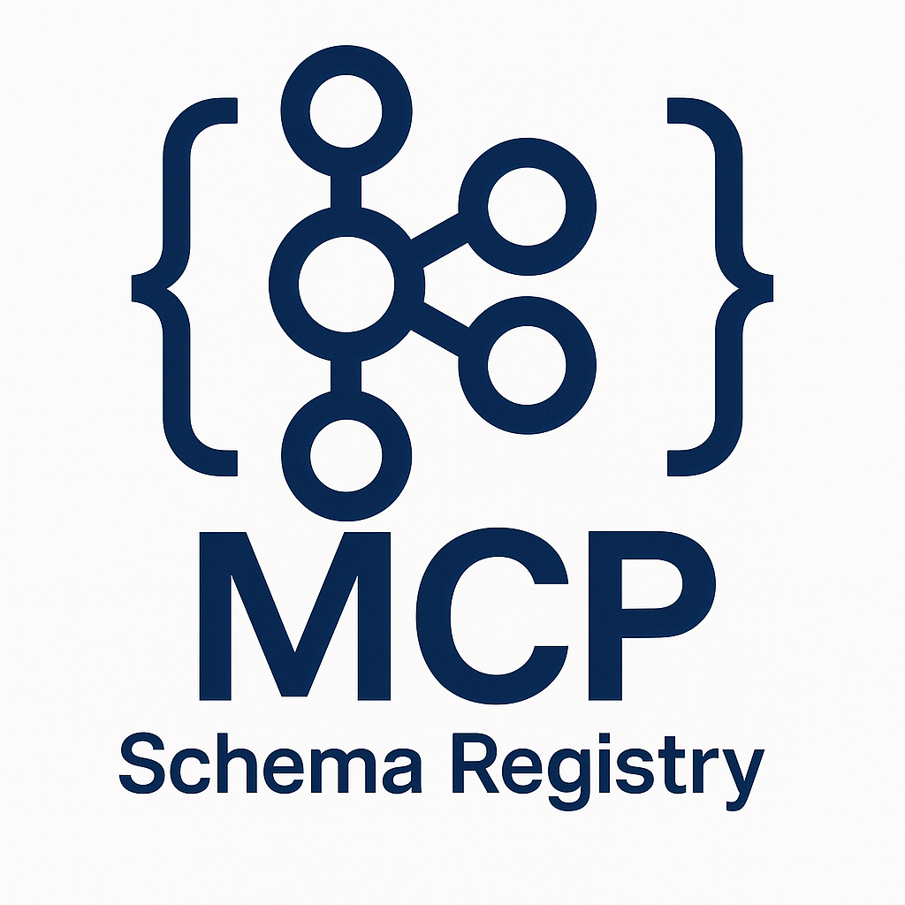

[](https://mseep.ai/app/aywengo-kafka-schema-reg-mcp)
[](https://opensource.org/licenses/MIT)
[](https://www.python.org/downloads/)
[](https://hub.docker.com/r/aywengo/kafka-schema-reg-mcp)
[](https://github.com/aywengo/kafka-schema-reg-mcp/releases)
[](https://github.com/aywengo/kafka-schema-reg-mcp/issues)
[](https://hub.docker.com/r/aywengo/kafka-schema-reg-mcp)
[](https://github.com/aywengo/kafka-schema-reg-mcp/graphs/commit-activity)
[](https://modelcontextprotocol.io)
[](https://archestra.ai/mcp-catalog/aywengo__kafka-schema-reg-mcp)

# Kafka Schema Registry MCP Server

A comprehensive **Model Context Protocol (MCP) server** that provides Claude Desktop and other MCP clients with tools for Kafka Schema Registry operations. Features advanced schema context support, multi-registry management, and comprehensive schema export capabilities.

<table width="100%">
<tr>
<td width="33%" style="vertical-align: top;">
<div style="background-color: white; padding: 20px; border-radius: 10px;">
  
</div>
</td>
<td width="67%" style="vertical-align: top; padding-left: 20px;">

> **🎯 True MCP Implementation**: Uses modern **FastMCP 2.8.0+ framework** with full **MCP 2025-06-18 specification compliance**. Fully compatible with Claude Desktop and other MCP clients using JSON-RPC over `stdio`.

**Latest Version:** [v2.1.5](CHANGELOG.md) | **Docker:** `aywengo/kafka-schema-reg-mcp:stable`
</td>
</tr>
</table>

## 📋 Table of Contents

- [🚀 Quick Start](#-quick-start)
- [✨ Key Features](#-key-features)
- [🛠️ Claude Code Skills](#️-claude-code-skills)
- [📦 Installation](#-installation)
- [⚙️ Configuration](#️-configuration)
- [💬 Usage Examples](#-usage-examples)
- [🔒 Authentication & Security](#-authentication--security)
- [📚 Documentation](#-documentation)
- [🧪 Testing](#-testing)
- [🚀 Deployment](#-deployment)
- [🤝 Contributing](#-contributing)
- [🆕 What's New](#-whats-new)

## 🚀 Quick Start

### 1. Run with Docker (Recommended)
```bash
# Latest stable release
docker pull aywengo/kafka-schema-reg-mcp:stable

# Recommended: Run with SLIM_MODE for optimal performance (reduced essential tool set)
docker run -e SCHEMA_REGISTRY_URL=http://localhost:8081 -e SLIM_MODE=true aywengo/kafka-schema-reg-mcp:stable

# OR run with full feature set for administrators/SRE
docker run -e SCHEMA_REGISTRY_URL=http://localhost:8081 aywengo/kafka-schema-reg-mcp:stable
```

### 2. Configure Claude Desktop
Copy a ready-to-use configuration from [`config-examples/`](config-examples/):

```bash
# macOS
cp config-examples/claude_desktop_stable_config.json ~/Library/Application\ Support/Claude/claude_desktop_config.json

# Linux  
cp config-examples/claude_desktop_stable_config.json ~/.config/claude-desktop/config.json
```

### 3. Start Using with Claude
Restart Claude Desktop and try these prompts:
- *"List all schema contexts"*
- *"Show me the subjects in the production context"* 
- *"Register a new user schema with fields for id, name, and email"*

## ✨ Key Features

- **🤖 Claude Desktop Integration** - Direct MCP integration with natural language interface
- **🏢 Multi-Registry Support** - Manage up to 8 Schema Registry instances simultaneously
- **📋 Schema Contexts** - Logical grouping for production/staging environment isolation
- **🔄 Schema Migration** - Cross-registry migration with backup and verification
- **📊 Comprehensive Export** - JSON, Avro IDL formats for backup and documentation
- **🔒 Production Safety** - VIEWONLY mode and per-registry access control
- **🔐 OAuth 2.1 Authentication** - Enterprise-grade security with scope-based permissions
- **📈 Real-time Progress** - Async operations with progress tracking and cancellation
- **🔗 Resource Linking** - HATEOAS navigation with enhanced tool responses
- **🧪 Full MCP Compliance** - 50+ tools following MCP 2025-06-18 specification
- **🚀 SLIM_MODE** - Reduce tool overhead from 50+ to ~9 essential tools for better LLM performance

> **📖 See detailed feature descriptions**: [docs/api-reference.md](docs/api-reference.md)

## 🛠️ Claude Code Skills

This project includes **5 specialized Claude Code skills** – 4 for automated schema development workflows plus 1 for schema context comparison (`/context-compare`, documented below):

### Available Skills

- **`/schema-generate`** - Generate production-ready Avro schemas from natural language
  ```
  /schema-generate event UserRegistered "user registration with userId, email, timestamp"
  ```

- **`/schema-evolve`** - Safely evolve schemas with automatic compatibility checking
  ```
  /schema-evolve user-profile "add optional phoneNumber field"
  ```

- **`/migration-plan`** - Create detailed migration plans between environments
  ```
  /migration-plan development staging
  ```

- **`/lint-and-test`** - Automated quality assurance workflows
  ```
  /lint-and-test quick        # Before commit (2-3s)
  /lint-and-test fix          # Auto-fix issues (20-30s)
  /lint-and-test pre-push     # Before push (10-15s)
  ```

### Getting Started with Skills

**Quick Start:** Read [`.claude-code/SKILLS_GUIDE.md`](.claude-code/SKILLS_GUIDE.md) - 5-minute tutorial

**Complete Reference:** [`.claude-code/skills/README.md`](.claude-code/skills/README.md) - Full documentation

**Setup Summary:** [`CLAUDE_CODE_SKILLS_SETUP.md`](CLAUDE_CODE_SKILLS_SETUP.md) - Configuration details

### Skills Features

- ✅ Natural language schema generation with templates
- ✅ Automatic compatibility checking (BACKWARD, FORWARD, FULL)
- ✅ Migration planning with rollback procedures
- ✅ Pre-commit and pre-push quality automation
- ✅ Integration with Black, Ruff, isort, Flake8
- ✅ Docker-based test execution
- ✅ Comprehensive error handling and auto-fix

**Try it now:** `/schema-generate event TestEvent "test with id and timestamp"`

## 📦 Installation

### Option A: Docker (Recommended)
```bash
# Production stable
docker pull aywengo/kafka-schema-reg-mcp:stable

# Latest development  
docker pull aywengo/kafka-schema-reg-mcp:latest

# Specific version
docker pull aywengo/kafka-schema-reg-mcp:2.1.3
```

#### Running with SLIM_MODE
To reduce LLM overhead, run with SLIM_MODE enabled:
```bash
# Run with a reduced essential tool set
docker run -e SCHEMA_REGISTRY_URL=http://localhost:8081 -e SLIM_MODE=true aywengo/kafka-schema-reg-mcp:stable
```

> **💡 SLIM_MODE Benefits:**
> - Reduces tool count to an essential subset
> - Significantly faster LLM response times
> - Lower token usage and reduced costs
> - Ideal for production read-only operations
> - Maintains full remote deployment support

### Option B: Local Python
```bash
git clone https://github.com/aywengo/kafka-schema-reg-mcp
cd kafka-schema-reg-mcp
pip install -r requirements.txt
python kafka_schema_registry_unified_mcp.py
```

### Option C: Docker Compose
```bash
docker-compose up -d  # Includes Schema Registry for testing
```

> **📖 Detailed installation guide**: [docs/deployment.md](docs/deployment.md)

## ⚙️ Configuration

### Single Registry Mode
```bash
export SCHEMA_REGISTRY_URL="http://localhost:8081"
export SCHEMA_REGISTRY_USER=""           # Optional
export SCHEMA_REGISTRY_PASSWORD=""       # Optional
export VIEWONLY="false"                  # Production safety
export SLIM_MODE="false"                 # Optional: Enable to reduce tool overhead (default: false)
```

### Multi-Registry Mode (Up to 8 Registries)
```bash
# Development Registry
export SCHEMA_REGISTRY_NAME_1="development"
export SCHEMA_REGISTRY_URL_1="http://dev-registry:8081"
export VIEWONLY_1="false"

# Production Registry (with safety)
export SCHEMA_REGISTRY_NAME_2="production"  
export SCHEMA_REGISTRY_URL_2="http://prod-registry:8081"
export VIEWONLY_2="true"                     # Read-only protection
```

### Claude Desktop Configuration
Pre-configured examples available in [`config-examples/`](config-examples/):

| Configuration | Use Case | File |
|---------------|----------|------|
| **Production** | Stable Docker deployment | [`claude_desktop_stable_config.json`](config-examples/claude_desktop_stable_config.json) |
| **Multi-Environment** | DEV/STAGING/PROD registries | [`claude_desktop_multi_registry_docker.json`](config-examples/claude_desktop_multi_registry_docker.json) |
| **Local Development** | Python local execution | [`claude_desktop_config.json`](config-examples/claude_desktop_config.json) |
| **View-Only Safety** | Production with safety | [`claude_desktop_viewonly_config.json`](config-examples/claude_desktop_viewonly_config.json) |

> **📖 Complete configuration guide**: [config-examples/README.md](config-examples/README.md)

### SLIM_MODE Configuration (Performance Optimization)

**SLIM_MODE** reduces the number of exposed MCP tools to an essential subset, significantly reducing LLM overhead and improving response times.

> **💡 Recommendation:** SLIM_MODE is **recommended for most use cases** as it provides all essential schema management capabilities with optimal performance.

#### When to Use SLIM_MODE (Recommended)
- **Default choice** for most users and day-to-day operations
- When experiencing slow LLM responses due to too many tools
- For production environments focused on read-only operations
- When you only need basic schema management capabilities
- To reduce token usage and improve performance

#### When to Use Non-SLIM Mode
- **For administrators or SRE teams** performing long-running operations
- When you need advanced operations like:
  - Schema migrations across registries
  - Bulk schema removals and cleanup operations
  - Complex batch operations and workflows
  - Interactive guided wizards for complex tasks
  - Comprehensive export/import operations

#### Enable SLIM_MODE
```bash
export SLIM_MODE="true"  # Reduces tools from 50+ to ~9
# Enables reduced essential tool set
```

#### Tools Available in SLIM_MODE
**Essential Read-Only Tools:**
- `ping` - Server health check
- `set_default_registry`, `get_default_registry` - Registry management
- `count_contexts`, `count_schemas`, `count_schema_versions` - Statistics

**Basic Write Operations:**
- `register_schema` - Register new schemas
- `check_compatibility` - Schema compatibility checking
- `create_context` - Create new contexts

**Essential Export Operations:**
- `export_schema` - Export single schema
- `export_subject` - Export all subject versions

**Resources Available (All Modes):**
- All 19 resources remain available in SLIM_MODE
- `registry://`, `schema://`, `subject://` resource URIs
- Full read access through resource-first approach

**Tools Hidden in SLIM_MODE:**
- All migration tools (`migrate_schema`, `migrate_context`)
- All batch operations (`clear_context_batch`)
- Advanced export/import tools (`export_context`, `export_global`)
- All interactive/elicitation tools (`*_interactive` variants)
- Heavy statistics tools with async operations
- Workflow tools
- Configuration update tools
- Delete operations

> **Note:** Task status tracking is now handled by FastMCP's built-in Docket system. Custom task management tools have been removed in favor of FastMCP's native task tracking.

> **Note:** You can switch between modes by restarting with `SLIM_MODE=false` to access the full tool set.

## 📊 MCP Tools and Resources

This section provides a comprehensive analysis of all MCP tools and resources exposed by the Kafka Schema Registry MCP Server.

### Backward Compatibility Wrapper Tools
These tools are maintained for backward compatibility with existing clients. They internally use efficient implementations but are exposed as tools to prevent "Tool not listed" errors. Consider migrating to the corresponding resources for better performance.

| **Tool Name** | **SLIM_MODE** | **Scope** | **Recommended Resource** | **Description** |
|---------------|---------------|-----------|--------------------------|-----------------|
| `list_registries` | ✅ | read | `registry://names` | List all configured registries |
| `get_registry_info` | ✅ | read | `registry://info/{name}` | Get registry information |
| `test_registry_connection` | ✅ | read | `registry://status/{name}` | Test registry connection |
| `test_all_registries` | ✅ | read | `registry://status` | Test all registry connections |
| `list_subjects` | ✅ | read | `registry://{name}/subjects` | List all subjects |
| `get_schema` | ✅ | read | `schema://{name}/{context}/{subject}` | Get schema content |
| `get_schema_versions` | ✅ | read | `schema://{name}/{context}/{subject}/versions` | Get schema versions |
| `get_global_config` | ✅ | read | `registry://{name}/config` | Get global configuration |
| `get_mode` | ✅ | read | `registry://mode` | Get registry mode |
| `list_contexts` | ✅ | read | `registry://{name}/contexts` | List all contexts |
| `get_subject_config` | ✅ | read | `subject://{name}/{context}/{subject}/config` | Get subject configuration |
| `get_subject_mode` | ✅ | read | `subject://{name}/{context}/{subject}/mode` | Get subject mode |

### Core MCP Tools

| **Category** | **Name** | **Type** | **SLIM_MODE** | **Scope** | **Description** |
|--------------|----------|----------|---------------|-----------|-----------------|
| **Core** | `ping` | Tool | ✅ | read | MCP ping/pong health check |
| **Registry Management** | `set_default_registry` | Tool | ✅ | admin | Set default registry |
| **Registry Management** | `get_default_registry` | Tool | ✅ | read | Get current default registry |
| **Schema Operations** | `register_schema` | Tool | ✅ | write | Register new schema version |
| **Schema Operations** | `check_compatibility` | Tool | ✅ | read | Check schema compatibility |
| **Context Management** | `create_context` | Tool | ✅ | write | Create new context |
| **Context Management** | `delete_context` | Tool | ❌ | admin | Delete context |
| **Subject Management** | `delete_subject` | Tool | ❌ | admin | Delete subject and versions |
| **Configuration** | `update_global_config` | Tool | ❌ | admin | Update global configuration |
| **Configuration** | `update_subject_config` | Tool | ❌ | admin | Update subject configuration |
| **Configuration** | `add_subject_alias` | Tool | ❌ | write | Create alias subject pointing to an existing subject |
| **Configuration** | `delete_subject_alias` | Tool | ❌ | write | Remove an alias subject |
| **Mode Management** | `update_mode` | Tool | ❌ | admin | Update registry mode |
| **Mode Management** | `update_subject_mode` | Tool | ❌ | admin | Update subject mode |
| **Statistics** | `count_contexts` | Tool | ✅ | read | Count contexts |
| **Statistics** | `count_schemas` | Tool | ✅ | read | Count schemas |
| **Statistics** | `count_schema_versions` | Tool | ✅ | read | Count schema versions |
| **Statistics** | `get_registry_statistics` | Tool | ❌ | read | Get comprehensive registry stats |
| **Export** | `export_schema` | Tool | ✅ | read | Export single schema |
| **Export** | `export_subject` | Tool | ✅ | read | Export all subject versions |
| **Export** | `export_context` | Tool | ❌ | read | Export all context subjects |
| **Export** | `export_global` | Tool | ❌ | read | Export all contexts/schemas |
| **Export** | `export_global_interactive` | Tool | ❌ | read | Interactive global export |
| **Migration** | `migrate_schema` | Tool | ❌ | admin | Migrate schema between registries |
| **Migration** | `migrate_context` | Tool | ❌ | admin | Migrate context between registries |
| **Migration** | `migrate_context_interactive` | Tool | ❌ | admin | Interactive context migration |
| **Comparison** | `compare_registries` | Tool | ❌ | read | Compare two registries |
| **Comparison** | `compare_contexts_across_registries` | Tool | ❌ | read | Compare contexts across registries |
| **Comparison** | `find_missing_schemas` | Tool | ❌ | read | Find missing schemas |
| **Batch Operations** | `clear_context_batch` | Tool | ❌ | admin | Clear context with batch operations |
| **Batch Operations** | `clear_multiple_contexts_batch` | Tool | ❌ | admin | Clear multiple contexts |
| **Interactive** | `register_schema_interactive` | Tool | ❌ | write | Interactive schema registration |
| **Interactive** | `check_compatibility_interactive` | Tool | ❌ | read | Interactive compatibility check |
| **Interactive** | `create_context_interactive` | Tool | ❌ | write | Interactive context creation |
| **Resource Discovery** | `list_available_resources` | Tool | ✅ | read | List all available resources |
| **Resource Discovery** | `suggest_resource_for_tool` | Tool | ✅ | read | Get resource migration suggestions |
| **Resource Discovery** | `generate_resource_templates` | Tool | ✅ | read | Generate resource URI templates |
| **Elicitation** | `submit_elicitation_response` | Tool | ❌ | write | Submit elicitation response |
| **Elicitation** | `list_elicitation_requests` | Tool | ❌ | read | List elicitation requests |
| **Elicitation** | `get_elicitation_request` | Tool | ❌ | read | Get elicitation request details |
| **Elicitation** | `cancel_elicitation_request` | Tool | ❌ | admin | Cancel elicitation request |
| **Elicitation** | `get_elicitation_status` | Tool | ❌ | read | Get elicitation system status |
| **Workflows** | `list_available_workflows` | Tool | ❌ | read | List available workflows |
| **Workflows** | `get_workflow_status` | Tool | ❌ | read | Get workflow status |
| **Workflows** | `guided_schema_migration` | Tool | ❌ | admin | Start schema migration wizard |
| **Workflows** | `guided_context_reorganization` | Tool | ❌ | admin | Start context reorganization wizard |
| **Workflows** | `guided_disaster_recovery` | Tool | ❌ | admin | Start disaster recovery wizard |
| **Utility** | `get_mcp_compliance_status_tool` | Tool | ❌ | read | Get MCP compliance status |
| **Utility** | `get_oauth_scopes_info_tool` | Tool | ❌ | read | Get OAuth scopes information |
| **Utility** | `test_oauth_discovery_endpoints` | Tool | ❌ | read | Test OAuth discovery endpoints |
| **Utility** | `get_operation_info_tool` | Tool | ❌ | read | Get operation metadata |
| **Utility** | `check_viewonly_mode` | Tool | ❌ | read | Check if registry is in viewonly mode |
| **RESOURCES** | `registry://status` | Resource | ✅ | read | Overall registry connection status |
| **RESOURCES** | `registry://info` | Resource | ✅ | read | Detailed server configuration |
| **RESOURCES** | `registry://mode` | Resource | ✅ | read | Registry mode detection |
| **RESOURCES** | `registry://names` | Resource | ✅ | read | List of configured registry names |
| **RESOURCES** | `registry://status/{name}` | Resource | ✅ | read | Specific registry connection status |
| **RESOURCES** | `registry://info/{name}` | Resource | ✅ | read | Specific registry configuration |
| **RESOURCES** | `registry://mode/{name}` | Resource | ✅ | read | Specific registry mode |
| **RESOURCES** | `registry://{name}/subjects` | Resource | ✅ | read | List subjects for registry |
| **RESOURCES** | `registry://{name}/contexts` | Resource | ✅ | read | List contexts for registry |
| **RESOURCES** | `registry://{name}/config` | Resource | ✅ | read | Global config for registry |
| **RESOURCES** | `schema://{name}/{context}/{subject}` | Resource | ✅ | read | Schema content with context |
| **RESOURCES** | `schema://{name}/{subject}` | Resource | ✅ | read | Schema content default context |
| **RESOURCES** | `schema://{name}/{context}/{subject}/versions` | Resource | ✅ | read | Schema versions with context |
| **RESOURCES** | `schema://{name}/{subject}/versions` | Resource | ✅ | read | Schema versions default context |
| **RESOURCES** | `subject://{name}/{context}/{subject}/config` | Resource | ✅ | read | Subject config with context |
| **RESOURCES** | `subject://{name}/{subject}/config` | Resource | ✅ | read | Subject config default context |
| **RESOURCES** | `subject://{name}/{context}/{subject}/mode` | Resource | ✅ | read | Subject mode with context |
| **RESOURCES** | `subject://{name}/{subject}/mode` | Resource | ✅ | read | Subject mode default context |
| **RESOURCES** | `elicitation://response/{request_id}` | Resource | ❌ | write | Elicitation response handling |

## 💬 Usage Examples

### Schema Management
```bash
# In Claude Desktop, use natural language:
"Register a user schema with id, name, email fields"
"Check if my updated schema is compatible"
"Export all schemas from staging context"
"List subjects in production context"
```

### Multi-Registry Operations  
```bash
"Compare development and production registries"
"Migrate user-events schema from staging to production"
"Test connections to all registries"
"Show me registry statistics"
```

### Batch Operations
```bash
"Clear all schemas from test context"
"Export global schemas for backup"
"Count schemas across all contexts"
```

> **📖 More examples**: [examples/](examples/) | **📖 Use cases**: [docs/use-cases.md](docs/use-cases.md)

## 🔒 Authentication & Security

### OAuth 2.1 Support (Optional)
```bash
# Enable authentication
export ENABLE_AUTH=true
export AUTH_ISSUER_URL="https://your-oauth-provider.com"
export AUTH_AUDIENCE="your-client-id"
```

**Supported Providers:** Azure AD, Google OAuth, Keycloak, Okta, GitHub

**Permission Scopes:**
- `read` - View schemas, configurations
- `write` - Register schemas, update configs (includes read)
- `admin` - Delete subjects, full control (includes write + read)

### Production Safety Features
- **VIEWONLY Mode** - Prevent accidental changes in production
- **URL Validation** - SSRF protection with configurable localhost access
- **Scope-based Authorization** - Fine-grained tool-level permissions
- **Per-Registry Controls** - Independent safety settings

> **📖 Security guide**: [docs/deployment.md#security](docs/deployment.md#security)

## 📚 Documentation

| Guide | Description |
|-------|-------------|
| **[API Reference](docs/api-reference.md)** | Complete tool documentation with examples |
| **[Subject Aliasing](docs/subject-alias.md)** | How to add and remove subject aliases |
| **[Use Cases](docs/use-cases.md)** | Real-world scenarios and implementation patterns |
| **[Deployment Guide](docs/deployment.md)** | Docker, Kubernetes, cloud platforms, CI/CD |
| **[IDE Integration](docs/ide-integration.md)** | VS Code, Claude Code, Cursor setup |
| **[Configuration Examples](config-examples/)** | Ready-to-use Claude Desktop configs |
| **[Testing Guide](TESTING_SETUP_GUIDE.md)** | Comprehensive testing setup |
| **[Changelog](CHANGELOG.md)** | Version history and migration notes |
| **[v2.0.0 Highlights](README-v2.0.0-HIGHLIGHTS.md)** | Major version features |

### Additional Resources
- **[Examples](examples/)** - Usage examples and code samples
- **[Scripts](scripts/)** - Utility scripts and automation
- **[Helm Charts](helm/)** - Kubernetes deployment
- **[Tests](tests/)** - Test suites and validation

## 🧪 Testing

### Quick Test
```bash
cd tests/
./run_all_tests.sh --quick    # Essential tests
./run_all_tests.sh           # Complete test suite
```

### Docker Testing
```bash
python tests/test_docker_mcp.py
```

### MCP Inspector Tests (UI-driven)
```bash
# From repository root
cd inspector-tests

# Single registry (DEV)
./run-inspector-tests.sh stable

# Multi-registry (DEV + PROD)
./run-inspector-tests.sh multi

# Test a specific Docker tag
DOCKER_VERSION=latest ./run-inspector-tests.sh stable
```

> **📖 Testing guide**: [TESTING_SETUP_GUIDE.md](TESTING_SETUP_GUIDE.md)

## 🚀 Deployment

### Production Docker
```bash
# With docker-compose
docker-compose up -d

# Direct Docker  
docker run -d -p 38000:8000 \
  -e SCHEMA_REGISTRY_URL=http://registry:8081 \
  aywengo/kafka-schema-reg-mcp:stable
```

### Kubernetes
```bash
# Using Helm charts
helm install kafka-schema-mcp ./helm/kafka-schema-reg-mcp
```

> **📖 Deployment guide**: [docs/deployment.md](docs/deployment.md)

## 🤝 Contributing

We welcome contributions! Please see:
- **[Contributing Guidelines](.github/CONTRIBUTING.md)** 
- **[Code of Conduct](.github/CODE_OF_CONDUCT.md)**
- **[Development Setup](docs/deployment.md#local-development)**

### Quick Development Setup
```bash
git clone https://github.com/aywengo/kafka-schema-reg-mcp
cd kafka-schema-reg-mcp
python -m venv .venv && source .venv/bin/activate
pip install -r requirements.txt
python kafka_schema_registry_unified_mcp.py
```

## 🆕 What's New

### v2.1.x (Latest)
- **🧭 Subject Aliasing** - New tools `add_subject_alias` and `delete_subject_alias`
- **🛠️ Fixes** - Evolution assistant and import interactive fixes
- **📦 Enhancements** - Continued MCP tool refinements and testing improvements
- **🗑️ Removed Deprecated Tools** - Custom task management tools removed in favor of FastMCP's built-in Docket system

### v2.0.x
- **🔒 Security Fixes** - Resolved credential exposure in logging
- **🤖 Interactive Schema Migration** - Smart migration with user preference elicitation
- **💾 Automatic Backups** - Pre-migration backup creation
- **✅ Post-Migration Verification** - Comprehensive schema validation  
- **🚀 FastMCP 2.8.0+ Framework** - Complete architecture upgrade
- **📊 MCP 2025-06-18 Compliance** - Latest protocol specification
- **🔐 OAuth 2.1 Generic Discovery** - Universal provider compatibility
- **🔗 Resource Linking** - HATEOAS navigation in tool responses

> **📖 Full changelog**: [CHANGELOG.md](CHANGELOG.md) | **📖 v2.0.0 features**: [README-v2.0.0-HIGHLIGHTS.md](README-v2.0.0-HIGHLIGHTS.md)

---
**🐳 Glama.ai:** 

<a href="https://glama.ai/mcp/servers/@aywengo/kafka-schema-reg-mcp">
  
</a>

---

**🐳 Docker Hub:** [`aywengo/kafka-schema-reg-mcp`](https://hub.docker.com/r/aywengo/kafka-schema-reg-mcp) | **📊 Stats:** 50+ MCP Tools (12 backward compatibility), 19 Resources, 8 Registries, OAuth 2.1, Multi-platform

**License:** MIT | **Maintainer:** [@aywengo](https://github.com/aywengo) | **Issues:** [GitHub Issues](https://github.com/aywengo/kafka-schema-reg-mcp/issues)
