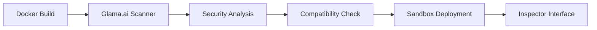

# Glama.ai Integration Guide

This guide covers the integration of the Kafka Schema Registry MCP Server with Glama.ai, including Docker deployment, MCP Inspector usage, and troubleshooting.

## Overview

[Glama.ai](https://glama.ai) is a platform that indexes, scans, and ranks MCP servers based on security, compatibility, and ease of use. It provides tools for discovering, testing, and deploying MCP servers in various environments.

### Key Integration Features

- **MCP Inspector**: Test MCP servers in sandboxed environments
- **Docker Image Analysis**: Automated inspection of containerized MCP servers
- **Security Scanning**: Vulnerability and compliance checks
- **Performance Monitoring**: Health checks and metrics collection

## Glama.ai MCP Inspector

The MCP Inspector allows you to start any MCP server and test it in a sandbox environment:

- **Ephemeral VMs**: Isolated testing environments
- **Unique URLs**: Each server gets a dedicated endpoint
- **SSE Transport**: Direct connection support
- **Debug Interface**: Web-based debugging tools

### Inspector Architecture

```
┌─────────────────┐    ┌──────────────────┐    ┌─────────────────────┐
│   Glama.ai      │───▶│   Sandbox VM     │───▶│  MCP Server         │
│   Web Interface │    │   (Ephemeral)    │    │  (Docker)           │
└─────────────────┘    └──────────────────┘    └─────────────────────┘
                              │
                              ▼
                       ┌──────────────────┐
                       │   Debug URL      │
                       │ (http://...)     │
                       └──────────────────┘
```

## Docker Integration

### Overview

Glama.ai's `inspectMcpServerDockerImage` function analyzes Docker images containing MCP servers. Our setup is specifically optimized for this inspection process.

### Image Requirements

For Glama.ai compatibility, Docker images must include:

1. **mcp-proxy**: Node.js proxy for MCP communication
2. **Health Checks**: Container health monitoring
3. **Environment Validation**: Required configuration checks
4. **Security Best Practices**: Non-root execution
5. **Proper Entrypoint**: Standardized startup script

### Deployment Process



## Quick Start

### 1. Build Docker Image

```bash
# From repository root
docker build -f glamaai/Dockerfile.glama -t mcp-server-glama .
```

### 2. Local Testing

```bash
# Test the container locally
cd glamaai
chmod +x test-docker-glama.sh
./test-docker-glama.sh
```

### 3. Deploy to Glama.ai

1. Push your Docker image to a registry
2. Submit the image URL to Glama.ai
3. Use the MCP Inspector to test functionality

## Configuration

### Required Environment Variables

| Variable | Description | Example |
|----------|-------------|---------|
| `SCHEMA_REGISTRY_URL` | Schema Registry endpoint | `http://confluent:8081` |
| `SCHEMA_REGISTRY_USER` | Authentication username | `schema_admin` |
| `SCHEMA_REGISTRY_PASSWORD` | Authentication password | `secret123` |

### Optional Environment Variables

| Variable | Description | Default |
|----------|-------------|---------|
| `MCP_HOST` | Server bind address | `0.0.0.0` |
| `MCP_PORT` | Server port | `8000` |
| `MCP_PATH` | API path | `/mcp` |
| `VIEWONLY` | View-only mode | `false` |
| `MCP_PROXY_DEBUG` | Debug logging | `false` |

### Production Configuration

```bash
# Production environment example
docker run -d \
    --name kafka-mcp-server \
    -e SCHEMA_REGISTRY_URL="https://schema-registry.prod.company.com" \
    -e SCHEMA_REGISTRY_USER="$SR_USERNAME" \
    -e SCHEMA_REGISTRY_PASSWORD="$SR_PASSWORD" \
    -e VIEWONLY=true \
    -p 8000:8000 \
    --restart unless-stopped \
    mcp-server-glama
```

## Security Considerations

### Container Security

- **Non-root execution**: Container runs as user `mcp`
- **Read-only filesystem**: Minimize attack surface
- **Resource limits**: Prevent resource exhaustion
- **Network isolation**: Restrict network access

### Credential Management

```bash
# Use Docker secrets for sensitive data
echo "$SCHEMA_REGISTRY_PASSWORD" | docker secret create sr_password -

# Reference in docker run
docker run \
    --secret sr_password \
    -e SCHEMA_REGISTRY_PASSWORD_FILE=/run/secrets/sr_password \
    mcp-server-glama
```

### Environment Variable Security

```bash
# Use environment files instead of command line
echo "SCHEMA_REGISTRY_PASSWORD=secret123" > .env

docker run --env-file .env mcp-server-glama
```

## Monitoring and Debugging

### Health Checks

The container includes built-in health monitoring:

```bash
# Check container health
docker ps --format "table {{.Names}}\t{{.Status}}"

# View health check logs
docker inspect mcp-server-glama --format='{{.State.Health.Status}}'
```

### Debug Mode

Enable verbose logging for troubleshooting:

```bash
docker run \
    -e MCP_PROXY_DEBUG=true \
    -e PYTHONUNBUFFERED=1 \
    mcp-server-glama
```

### Log Analysis

```bash
# View container logs
docker logs mcp-server-glama

# Follow logs in real-time
docker logs -f mcp-server-glama

# Filter for specific events
docker logs mcp-server-glama 2>&1 | grep "ERROR\|WARN"
```

## Troubleshooting

### Common Issues

#### 1. Connection Refused

**Symptoms**: Cannot connect to Schema Registry
```
ERROR: Failed to connect to http://schema-registry:8081
```

**Solutions**:
- Verify `SCHEMA_REGISTRY_URL` is correct
- Check network connectivity
- Validate authentication credentials

#### 2. Permission Denied

**Symptoms**: Container startup fails
```
ERROR: Permission denied accessing /app
```

**Solutions**:
- Ensure entrypoint.sh has execute permissions
- Verify Docker user has proper permissions
- Check SELinux/AppArmor policies

#### 3. MCP Proxy Issues

**Symptoms**: Proxy fails to start
```
ERROR: mcp-proxy command not found
```

**Solutions**:
- Rebuild Docker image
- Check Node.js installation
- Verify npm package installation

#### 4. Memory Issues

**Symptoms**: Container OOM killed
```
Container killed due to memory limit
```

**Solutions**:
- Increase memory limits
- Monitor resource usage
- Optimize application configuration

### Debug Commands

```bash
# Check container resource usage
docker stats mcp-server-glama

# Execute shell in running container
docker exec -it mcp-server-glama /bin/bash

# Check environment variables
docker exec mcp-server-glama printenv

# Test connectivity from container
docker exec mcp-server-glama curl -v $SCHEMA_REGISTRY_URL/subjects
```

## Advanced Configuration

### Custom CA Certificates

For self-signed certificates:

```dockerfile
# Add to Dockerfile
COPY custom-ca.crt /usr/local/share/ca-certificates/
RUN update-ca-certificates
```

### Multi-Registry Setup

```bash
# Configure multiple registries
docker run \
    -e SCHEMA_REGISTRY_URL="http://primary:8081,http://backup:8081" \
    -e SCHEMA_REGISTRY_FALLBACK=true \
    mcp-server-glama
```

### Performance Tuning

```bash
# Optimize for high throughput
docker run \
    --cpus="2.0" \
    --memory="2g" \
    -e WORKERS=4 \
    -e MAX_CONNECTIONS=1000 \
    mcp-server-glama
```

## CI/CD Integration

### GitHub Actions

```yaml
name: Build and Test MCP Server

on: [push, pull_request]

jobs:
  test:
    runs-on: ubuntu-latest
    steps:
      - uses: actions/checkout@v3
      
      - name: Build Docker image
        run: docker build -f glamaai/Dockerfile.glama -t mcp-test .
      
      - name: Test container
        run: |
          cd glamaai
          chmod +x test-docker-glama.sh
          ./test-docker-glama.sh
```

### GitLab CI

```yaml
stages:
  - build
  - test

build:
  stage: build
  script:
    - docker build -f glamaai/Dockerfile.glama -t $CI_REGISTRY_IMAGE .
    - docker push $CI_REGISTRY_IMAGE

test:
  stage: test
  script:
    - cd glamaai && ./test-docker-glama.sh
```

## Production Deployment

### Docker Compose

```yaml
version: '3.8'
services:
  kafka-mcp:
    build:
      context: .
      dockerfile: glamaai/Dockerfile.glama
    environment:
      - SCHEMA_REGISTRY_URL=http://schema-registry:8081
      - SCHEMA_REGISTRY_USER=admin
      - SCHEMA_REGISTRY_PASSWORD_FILE=/run/secrets/sr_password
    secrets:
      - sr_password
    ports:
      - "8000:8000"
    healthcheck:
      test: ["CMD", "python", "-c", "import kafka_schema_registry_unified_mcp"]
      interval: 30s
      timeout: 10s
      retries: 3
    restart: unless-stopped

secrets:
  sr_password:
    external: true
```

### Kubernetes

```yaml
apiVersion: apps/v1
kind: Deployment
metadata:
  name: kafka-mcp-server
spec:
  replicas: 2
  selector:
    matchLabels:
      app: kafka-mcp-server
  template:
    metadata:
      labels:
        app: kafka-mcp-server
    spec:
      containers:
      - name: mcp-server
        image: your-registry/mcp-server-glama:latest
        env:
        - name: SCHEMA_REGISTRY_URL
          value: "http://schema-registry:8081"
        - name: SCHEMA_REGISTRY_USER
          valueFrom:
            secretKeyRef:
              name: schema-registry-creds
              key: username
        - name: SCHEMA_REGISTRY_PASSWORD
          valueFrom:
            secretKeyRef:
              name: schema-registry-creds
              key: password
        ports:
        - containerPort: 8000
        livenessProbe:
          httpGet:
            path: /health
            port: 8000
          initialDelaySeconds: 30
          periodSeconds: 10
```

## Support and Resources

### Documentation

- [Project README](../README.md)
- [Glama.ai Docker Setup](../glamaai/README.md)
- [MCP Protocol Specification](https://modelcontextprotocol.io)

### Community

- [GitHub Issues](https://github.com/aywengo/kafka-schema-reg-mcp/issues)
- [Glama.ai Discord](https://discord.gg/glama-ai)
- [MCP Community](https://github.com/modelcontextprotocol)

### Getting Help

1. **Check Logs**: Review container and application logs
2. **Test Connectivity**: Verify network and service access
3. **Validate Configuration**: Ensure all required variables are set
4. **Search Issues**: Look for similar problems in GitHub issues
5. **Create Issue**: Report new problems with detailed information

### Reporting Issues

When reporting issues, include:

- Docker version and host OS
- Complete error messages and logs
- Environment configuration (sanitized)
- Steps to reproduce the problem
- Expected vs actual behavior