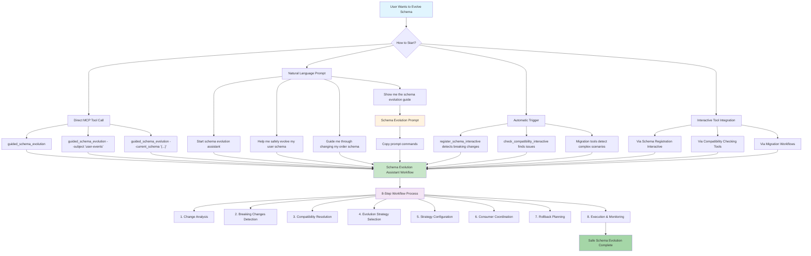

# Schema Evolution Assistant Workflow

The Schema Evolution Assistant is an advanced multi-step workflow that guides users through the complex process of safely evolving Avro schemas in Apache Kafka environments. This workflow helps prevent breaking changes, coordinates consumer updates, and ensures smooth schema transitions.

## Overview

Schema evolution is one of the most critical and error-prone operations in event-driven architectures. The Schema Evolution Assistant automates best practices and provides guided decision-making to help teams:

- **Analyze schema changes** for compatibility and breaking changes
- **Suggest evolution strategies** based on change analysis
- **Coordinate consumer updates** before applying schema changes
- **Implement rollback plans** in case of issues
- **Monitor the evolution process** with detailed feedback

## Workflow Features

### 🔍 **Intelligent Change Analysis**
- Detects field additions, removals, type changes, and constraint modifications
- Identifies breaking vs. non-breaking changes
- Analyzes nested record structures and complex types
- Provides detailed impact assessment

### 📋 **Strategic Planning**
- Suggests appropriate evolution strategies (forward, backward, full compatibility)
- Recommends consumer update sequences
- Identifies potential rollback scenarios
- Estimates migration complexity and risk

### 🔄 **Coordinated Execution**
- Guides through consumer preparation steps
- Validates readiness before schema deployment
- Provides rollback procedures if needed
- Monitors post-deployment health

## Workflow Steps

### Step 1: Schema Analysis
The workflow begins by analyzing the current and proposed schemas to identify all changes.

**Elicited Information:**
- Current schema subject and version
- Proposed schema definition
- Target registry and context

**Analysis Output:**
- List of detected changes with impact assessment
- Breaking change identification
- Compatibility matrix with existing versions

### Step 2: Strategy Selection
Based on the analysis, the workflow presents evolution strategies and elicits user preferences.

**Available Strategies:**
- **Forward Compatible**: New schema can read old data
- **Backward Compatible**: Old schema can read new data  
- **Full Compatible**: Bidirectional compatibility
- **Breaking Change**: Requires coordinated migration

**Elicited Preferences:**
- Preferred compatibility level
- Acceptable downtime window
- Consumer update coordination preferences
- Rollback tolerance

### Step 3: Consumer Coordination
For complex changes, the workflow helps coordinate consumer updates.

**Coordination Steps:**
- Identify affected consumers and their update requirements
- Plan consumer update sequence and timing
- Validate consumer readiness and compatibility
- Coordinate deployment windows

### Step 4: Execution Planning
The workflow creates a detailed execution plan with specific steps and validation checkpoints.

**Plan Components:**
- Pre-deployment validation steps
- Schema registration sequence
- Consumer update timeline
- Health monitoring checkpoints
- Rollback procedures

### Step 5: Implementation Guidance
Finally, the workflow provides step-by-step implementation guidance with validation at each stage.

**Implementation Features:**
- Interactive step execution with validation
- Real-time compatibility checking
- Automated rollback triggers
- Post-deployment health monitoring

## Example Scenarios

### Scenario 1: Adding Optional Fields
**Change**: Adding new optional fields to an existing schema
**Strategy**: Forward compatible evolution
**Coordination**: Minimal - consumers can ignore new fields
**Risk**: Low

### Scenario 2: Removing Deprecated Fields
**Change**: Removing fields that are no longer used
**Strategy**: Backward compatible evolution with consumer updates
**Coordination**: Update consumers first, then remove fields
**Risk**: Medium

### Scenario 3: Changing Field Types
**Change**: Converting string field to integer
**Strategy**: Breaking change with coordinated migration
**Coordination**: Full consumer update coordination required
**Risk**: High

### Scenario 4: Complex Nested Changes
**Change**: Modifying nested record structures
**Strategy**: Multi-phase evolution with intermediate schemas
**Coordination**: Staged rollout with validation checkpoints
**Risk**: High

## Change Analysis Details

The workflow performs comprehensive analysis of schema changes:

### Field-Level Changes
- **Add Field**: Analyzes default values and nullability
- **Remove Field**: Identifies potential data loss and consumer impact
- **Modify Type**: Assesses type compatibility and conversion requirements
- **Rename Field**: Detects field renames and suggests alias strategies

### Schema-Level Changes
- **Namespace Changes**: Impact on fully qualified names
- **Schema Name Changes**: Consumer reference updates required
- **Alias Modifications**: Backward compatibility implications

### Complex Type Analysis
- **Record Types**: Recursive analysis of nested structures
- **Array Types**: Element type compatibility assessment
- **Map Types**: Value type evolution analysis
- **Union Types**: Type addition/removal impact

## Best Practices Integrated

The workflow incorporates industry best practices:

### 🛡️ **Safety First**
- Always analyze before implementing
- Validate compatibility at each step
- Maintain rollback capabilities
- Monitor post-deployment health

### 📊 **Data-Driven Decisions**
- Use compatibility matrices for decision making
- Analyze consumer usage patterns
- Consider performance implications
- Plan for future evolution needs

### 🤝 **Team Coordination**
- Involve all stakeholders in planning
- Document evolution decisions and rationale
- Coordinate deployment windows
- Establish clear rollback procedures

### 📈 **Continuous Improvement**
- Learn from evolution experiences
- Refine strategies based on outcomes
- Build organizational knowledge
- Automate common patterns

## Integration with MCP Tools

The Schema Evolution Assistant integrates seamlessly with other MCP tools:

- **Schema Registry Tools**: For schema validation and registration
- **Migration Tools**: For cross-registry schema migrations
- **Compatibility Tools**: For compatibility validation
- **Export Tools**: For schema backup and documentation
- **Statistics Tools**: For impact analysis and monitoring

## Getting Started

### Entry Points Diagram



### How to Start

To start the Schema Evolution Assistant workflow:

```bash
# Using MCP client
guided_schema_evolution

# With optional pre-population
guided_schema_evolution --subject "user-events" --current_schema "{...}"

# Via natural language
"Start schema evolution assistant"
"Help me safely evolve my user schema"
```

The workflow will guide you through each step with interactive prompts and detailed explanations.

## Troubleshooting

### Common Issues

**Issue**: Compatibility validation fails
**Solution**: Review change analysis and consider alternative evolution strategies

**Issue**: Consumer coordination is complex
**Solution**: Break changes into smaller, incremental steps

**Issue**: Rollback needed after deployment
**Solution**: Follow the generated rollback plan and validate each step

### Getting Help

- Use the workflow's built-in help and explanations
- Consult the detailed change analysis reports
- Review compatibility matrices and recommendations
- Contact your platform team for complex scenarios

## Advanced Features

### Custom Evolution Strategies
The workflow supports custom evolution strategies for complex organizational requirements.

### Integration with CI/CD
The workflow can be integrated into automated deployment pipelines with proper validation gates.

### Multi-Registry Coordination
For organizations using multiple schema registries, the workflow can coordinate cross-registry evolution.

### Performance Impact Analysis
Advanced analysis includes performance implications of schema changes on serialization/deserialization.

---

The Schema Evolution Assistant represents the culmination of schema management best practices, providing a guided, safe, and efficient approach to one of the most challenging aspects of event-driven architecture management. 